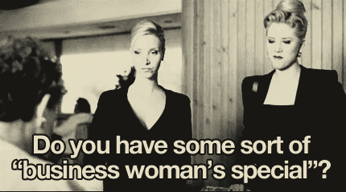

# Welcome Business Consultants!

###Scenario
You're a newly-minted business consultant who's just snagged a very lucrative client! Congratulations! There's only one catch: neither of you knows what to build or how to build it. 

###Goal
Our goal is to build **and style** a check-out form, and submit it. Your form MUST have AT LEAST 6 different kinds of form elements (not including the submit button).

##User Stories
  1. As a shopper, I expect to be presented with a choice of products to buy
  1. As a shopper, I should be able to choose one product to purchase.
    1. Sytem should bring user to a partially-filled checkout page.
  2. As a shopper, I can use the check-out page to further customize my purchase.
  3. As a simulated shopper, I expect submitting the check-out form will take me to a simulated confirmation page that only displays the state of the submitted form.

##Deliverables
  1. Design and build a commercial website product page.
  2. Design and build a functioning commercial website checkout page.

###Lab Procedure
In this 3-hour lab, we're going to divide the classroom into a few groups, each consisting of at least 4 people. 

A functioning group should have at least one each of the following:
  1. **a client**: _has the idea/need for the website_
  4. **a designer**: _produces a functional design and/or wireframe_
  3. **a researcher**: _does any/all related research tasks_
  2. **a developer**: _builds the website_

##Round 0:
  1. Count off successively to form groups of 4 (e.g. 28 students = 7 groups of 4).
  1. Introduce yourselves: Break the ice! Who has a background in design? research?

##Round 1:
Now that we're in groups and since none of us fit the job descriptions above, let's take turns and all inhabit each role. 

####The Client
You'll all start out brainstorming to come up with a hypothetical business.
  1. What does your business sell? Footies? Electric cardigans? Full-body wigs?
  2. Why do you need this website?

> Your goal is to present the user with three products. Clicking on one of them will bring the user to the check-out page.

##Round 2 (20 minutes):
####The Designer
You'll all collaborate on a design. 
  1. Design a page that fits your business (Page A).
  2. Design a checkout page to suit your product (Page B).
  1. Produce wireframes and preliminary designs.
  1. https://wireframe.cc/

##Round 3 (45 minutes):
####The Researcher
Now that you know what you're selling, and how it's going to look, let's do some research.

  1. Go to [MDN](https://developer.mozilla.org/en-US/docs/Web/Guide/HTML/Forms) and research all the html form controls _that are stable on Safari_.
  2. Choose 6 that fit your business model and checkout form. 

##Round 4 ()

